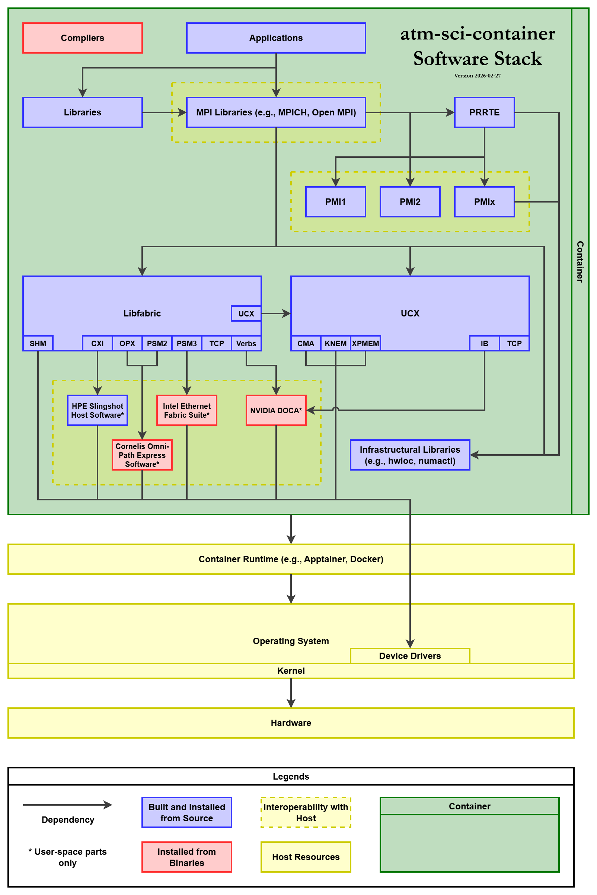

# atm-sci-container

> [!NOTE]
> This `README.md` is a work in progress. More information to come when development stabilizes...

High-performance computing (HPC) containers for parallel workloads (e.g., MPI, OpenMP), delivering portability, reproducibility, and optimal single-/multi-node performance out of the box.

* [atm-sci-container](#atm-sci-container)
  * [Usage](#usage)
  * [Container Registries](#container-registries)
  * [Container Image Variants and Tags](#container-image-variants-and-tags)
  * [Included Software Stack](#included-software-stack)
  * [Included Device Drivers](#included-device-drivers)
  * [Supported Transports](#supported-transports)
  * [Building from Source](#building-from-source)

## Usage

WIP...

## Container Registries

WIP...

## Container Image Variants and Tags

The container images are available in **2** variants:

1. `hpc-container`: A general-purpose HPC container image for parallel workloads (e.g., MPI, OpenMP). It includes everything listed in the "Included Software Stack" section below, except for libraries that are commonly used by atmospheric models.
2. `atm-sci-container`: An HPC container image tailored for atmospheric sciences applications. Built upon `hpc-container`, it includes additional libraries that are commonly used by atmospheric models such as CESM, MPAS, and WRF.

Both variants are tagged in the `${VERSION}_${COMPILER}_${MPI}` format, where:

* `${VERSION}` indicates the version of the container image. It should correspond to a Git tag in this project.
* `${COMPILER}` indicates the compiler toolchain available in the container image. It should be one of `gcc-11`, `gcc-12`, `gcc-13`, `gcc-14`, `gcc-15`, `intel-2024`, or `intel-2025`.
* `${MPI}` indicates the MPI library available in the container image. It should be one of `mpich-4`, `open-mpi-4`, `open-mpi-5`, or `intel-mpi`.

For each variant and `${VERSION}`, there are currently **23** different combinations of compiler toolchains and MPI libraries available for use.

## Included Software Stack

<picture>
  <source media="(prefers-color-scheme: dark)" srcset="./README-Container-Software-Stack-Dark.png">
  <source media="(prefers-color-scheme: light)" srcset="./README-Container-Software-Stack-Light.png">
  
</picture>

* AlmaLinux Base Image 9.7
* Infrastructural Libraries
  * zlib 1.3.2
  * numactl (Distribution version)
  * hwloc 2.12.2
  * libevent (Distribution version)
  * PMI2 from Slurm 24.11.7
  * PMIx 5.0.10
  * PRRTE 3.0.13
* Communication Libraries
  * UCX 1.19.1
  * libfabric 2.4.0
* Compilers
  * GNU Compiler Collection 11 (C, C++, Fortran)
  * GNU Compiler Collection 12 (C, C++, Fortran)
  * GNU Compiler Collection 13 (C, C++, Fortran)
  * GNU Compiler Collection 14 (C, C++, Fortran)
  * GNU Compiler Collection 15 (C, C++, Fortran)
  * Intel oneAPI Compiler 2024.2.1 (C, C++, Fortran)
  * Intel oneAPI Compiler 2025.3.2 (C, C++, Fortran)
* MPI Libraries
  * MPICH 4.3.2
  * Open MPI 4.1.8
  * Open MPI 5.0.10
  * Intel MPI 2021.13.1 (Only when paired with Intel oneAPI Compiler 2024.2.1)
  * Intel MPI 2021.17.2 (Only when paired with Intel oneAPI Compiler 2025.3.2)
* Libraries
  * libaec 1.1.6
  * zlib 1.3.2
  * zstd 1.5.7
  * libjpeg 9f
  * JasPer 2.0.33
  * libpng 1.6.55
  * HDF5 1.14.6
    * Serial mode
    * Parallel mode
  * PNetCDF 1.14.1
  * NetCDF-C 4.9.3
    * Classic data model, Serial mode
    * Enhanced data model, Serial mode
    * Enhanced data model, Parallel mode
  * NetCDF-Fortran 4.6.2
    * Classic data model, Serial mode
    * Enhanced data model, Serial mode
    * Enhanced data model, Parallel mode
  * ParallelIO 2.6.8
  * Netlib LAPACK 3.12.1
  * ESMF 8.9.1
  * pFUnit 4.16.0

## Included Device Drivers

The user-space components of the following device drivers are included in the container images.

* Cornelis Omni-Path Express Software 12.1.0.1.4
* HPE Slingshot Host Software 12.0.2
* Intel Ethernet Fabric Suite 12.1.0.0.149
* NVIDIA DOCA 2.9.4

Please refer to the vendor documentation for the exact list of supported hardware.

## Supported Transports

The following high-speed and low-latency transports are supported by the container images. At runtime, if the matching kernel-space components and the actual hardware are present, optimal MPI communication performance can be achieved out of the box.

* Intra-node Communication via Linux Kernel Features
  * Cross Memory Attach (CMA)
  * Cross Process Memory Mapping (XPMEM)
  * Kernel Nemesis (KNEM)
* Inter-node Communication via HPC Interconnects
  * AWS Elastic Fabric Adapter
  * Cornelis Omni-Path NIC
  * HPE Slingshot 11 NIC
  * Intel Ethernet 800 NIC
  * NVIDIA ConnectX InfiniBand NIC

Please refer to the vendor documentation for the exact list of supported hardware.

## Building from Source

To build the container images from source, use the `Containerfile` to invoke the build process directly, or use the `Makefile` for convenience. You must be running an x86-64 Linux system with either `docker` or `podman` installed. If both are found, `docker` takes precedence. The system architecture is limited to what is supported by the included device drivers, and is not decided by this project.

1. Pull the base and data images.

    ```shell
    make stage
    ```

2. Build the container images by specifying the desired combinations of `VERSION`, `COMPILER`, and `MPI`. See the "Container Image Variants and Tags" section above for details. The `build-hpc` target will build the `hpc-container` variant, while the `build-atm-sci` target will build the `atm-sci-container` variant. The `build` target will build both in order.

    ```shell
    make build [VERSION=...] [COMPILER=...] [MPI=...]
    make build-hpc [VERSION=...] [COMPILER=...] [MPI=...]
    make build-atm-sci [VERSION=...] [COMPILER=...] [MPI=...]
    ```

3. Clean up the built and dangling container images.

    ```shell
    make clean
    ```
