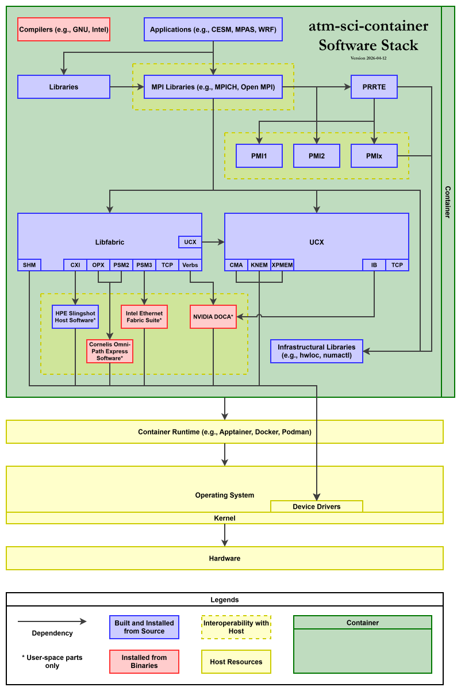

# atm-sci-container

* [atm-sci-container](#atm-sci-container)
  * [Prerequisites](#prerequisites)
  * [Quick Start](#quick-start)
    * [CESM](#cesm)
    * [MPAS](#mpas)
    * [WRF](#wrf)
  * [Container Registries](#container-registries)
  * [Container Image Variants and Tags](#container-image-variants-and-tags)
  * [Usage](#usage)
    * [Running a Container](#running-a-container)
    * [User Configuration](#user-configuration)
    * [Environment Configuration](#environment-configuration)
      * [Presets](#presets)
      * [Environment Components](#environment-components)
    * [Running a Container across Multiple Nodes](#running-a-container-across-multiple-nodes)
  * [Included Software Stack](#included-software-stack)
  * [Included Device Drivers](#included-device-drivers)
  * [Supported Transports](#supported-transports)
  * [Building from Source](#building-from-source)

**High-performance computing (HPC) containers** for parallel workloads (e.g., MPI, OpenMP), delivering portability, reproducibility, and optimal single-/multi-node performance out of the box.

For an overview of why containers remain valuable even for HPC scenarios, see the [Apptainer introduction](https://apptainer.org/docs/user/latest/introduction.html).

## Prerequisites

* A computer running an **x86-64 Linux system**, preferably on bare metal. Virtualization should also be fine, but usually incurs significant performance overhead. The supported system architecture is constrained by the included device drivers, not by this project.
* A **container runtime**: [Docker](https://docs.docker.com/engine/install), [Podman](https://podman.io/docs/installation), or [Apptainer](https://apptainer.org/get-started).

## Quick Start

### CESM

> [!NOTE]
> In this walkthrough, we will configure [CAM-SIMA](https://github.com/ESCOMP/CAM-SIMA) with MPAS dynamical core, a global 480-km mesh, Kessler microphysics, and the moist baroclinic wave initial condition. CAM-SIMA is a component model of [CESM](https://github.com/ESCOMP/CESM). The model will be built and run with GNU compilers version 15 and MPICH version 4.

Pull the appropriate container image and create a container from it:

```shell
docker image pull "docker.io/kuanchihwang/atm-sci-container:latest_gnu-15_mpich-4"
docker container run -it --rm \
    --env "CONTAINER_PRESET=cesm" \
    --volume "working:/working" \
    "docker.io/kuanchihwang/atm-sci-container:latest_gnu-15_mpich-4"
```

You are now in an interactive shell session inside the created container. Continue with:

```shell
# Set up Git username and email because CIME demands that you have them...
git config --global user.name "Insider"
git config --global user.email "insider@atm-sci-container"

# Download model input data.
mkdir -pv "/working/cesm-data-root/inputdata/atm/cam/chem/trop_mozart/ub"
wget -P "/working/cesm-data-root/inputdata/atm/cam/chem/trop_mozart/ub" \
    "https://data.gdex.ucar.edu/d651077/cesmdata/inputdata/atm/cam/chem/trop_mozart/ub/clim_p_trop.nc"
mkdir -pv "/working/cesm-data-root/inputdata/atm/cam/inic/mpas"
wget -P "/working/cesm-data-root/inputdata/atm/cam/inic/mpas" \
    "https://data.gdex.ucar.edu/d651077/cesmdata/inputdata/atm/cam/inic/mpas/mpasa480_L32_notopo_coords_c240507.nc"
wget -P "/working/cesm-data-root/inputdata/atm/cam/inic/mpas" \
    "https://data.gdex.ucar.edu/d651077/cesmdata/inputdata/atm/cam/inic/mpas/mpasa480.graph.info"
wget -P "/working/cesm-data-root/inputdata/atm/cam/inic/mpas" \
    "https://data.gdex.ucar.edu/d651077/cesmdata/inputdata/atm/cam/inic/mpas/mpasa480.graph.info.part.4"
# These should not be needed, but CIME wants them anyway...
mkdir -pv "/working/cesm-data-root/inputdata/share/meshes"
wget -P "/working/cesm-data-root/inputdata/share/meshes" \
    "https://data.gdex.ucar.edu/d651077/cesmdata/inputdata/share/meshes/gx1v7_151008_ESMFmesh.nc"
wget -P "/working/cesm-data-root/inputdata/share/meshes" \
    "https://data.gdex.ucar.edu/d651077/cesmdata/inputdata/share/meshes/mpasa480_ESMFmesh-211109.nc"

# Clone model source code.
git clone --branch development --depth 1 "https://github.com/ESCOMP/CAM-SIMA.git"
cd CAM-SIMA
./bin/git-fleximod update
cd ..

# Copy model configuration files.
cp -av /usr/local/share/cesm-config/atm-sci-container CAM-SIMA/ccs_config/machines

# Configure model.
# Normally, `CESM_NTASKS_PER_NODE` is auto-detected at the container entrypoint.
# For simplicity, we override it here.
export CESM_NTASKS_PER_NODE="4"
./CAM-SIMA/cime/scripts/create_newcase \
    --machine atm-sci-container \
    --compiler gnu \
    --mpilib mpich \
    --case /working/cesm-case-root/cam-sima-development \
    --compset FKESSLER \
    --res mpasa480_mpasa480 \
    --run-unsupported
cd /working/cesm-case-root/cam-sima-development
./case.setup
cat > user_nl_cam << "EOF"
debug_output = 3
hist_add_inst_fields;h0: U,V,T,Q,PMID
hist_file_type;h0: history
hist_max_frames;h0: 24
hist_output_frequency;h0: hours
hist_write_nstep0;h0: .true.
EOF

# Build model.
./case.build

# Run model, which only takes about half a minute to complete.
./case.submit

# Examine model logs and history output.
cd /working/cesm-output-root/archive/cam-sima-development
# Model logs are located in the `logs` directory.
ls -l logs
# Model history output is located in the `atm/hist` directory.
ls -l atm/hist
```

Congratulations! You just built CAM-SIMA and ran a test case on your own system with little effort.

Traditionally, porting CESM and its component models like CAM-SIMA to a new system requires substantial effort. Its notoriously difficult dependency stack certainly does not help reduce the barrier to entry. In contrast, with `atm-sci-container`, the standard CAM-SIMA dependencies are already included, and the container entrypoint takes care of the environment setup for you. There is no need to mess with any packages or environment variables at all. Hooray!

If multi-node execution and optimal performance are desired, it is recommended to use [Apptainer](https://apptainer.org). Specifically, refer to the "[Running a Container](#running-a-container)" and "[Running a Container across Multiple Nodes](#running-a-container-across-multiple-nodes)" sections for details.

### MPAS

> [!NOTE]
> In this walkthrough, we will build [MPAS](https://github.com/MPAS-Dev/MPAS-Model) with Intel compilers version 2025 and Open MPI version 5.

Pull the appropriate container image and create a container from it:

```shell
docker image pull "docker.io/kuanchihwang/atm-sci-container:latest_intel-2025_open-mpi-5"
docker container run -it --rm \
    --env "CONTAINER_PRESET=mpas" \
    --volume "working:/working" \
    "docker.io/kuanchihwang/atm-sci-container:latest_intel-2025_open-mpi-5"
```

You are now in an interactive shell session inside the created container. Continue with:

```shell
# Clone model source code.
git clone --branch master --depth 1 "https://github.com/MPAS-Dev/MPAS-Model.git"

# Build model.
cd MPAS-Model
make intel CORE="init_atmosphere"
make intel CORE="atmosphere"
# You should find that model executables such as `init_atmosphere_model`, `atmosphere_model`, etc. have been generated.
ls -l
```

You can now run the model as you normally would. Yes, it is really that easy. With `atm-sci-container`, the standard MPAS dependencies are already included, and the container entrypoint takes care of the environment setup for you. There is no need to mess with any packages or environment variables at all. Hooray!

If multi-node execution and optimal performance are desired, it is recommended to use [Apptainer](https://apptainer.org). Specifically, refer to the "[Running a Container](#running-a-container)" and "[Running a Container across Multiple Nodes](#running-a-container-across-multiple-nodes)" sections for details.

### WRF

> [!NOTE]
> In this walkthrough, we will build [WRF](https://github.com/wrf-model/WRF) with Intel compilers version 2024 and Open MPI version 4.

Pull the appropriate container image and create a container from it:

```shell
docker image pull "docker.io/kuanchihwang/atm-sci-container:latest_intel-2024_open-mpi-4"
docker container run -it --rm \
    --env "CONTAINER_PRESET=wrf" \
    --volume "working:/working" \
    "docker.io/kuanchihwang/atm-sci-container:latest_intel-2024_open-mpi-4"
```

You are now in an interactive shell session inside the created container. Continue with:

```shell
# Clone model source code.
git clone --branch master --depth 1 "https://github.com/wrf-model/WRF.git"
cd WRF
git submodule update --init --recursive
cd ..
git clone --branch master --depth 1 "https://github.com/wrf-model/WPS.git"
cd WPS
# WPS demands a very narrow JasPer version range, which is completely unreasonable. Relax it a bit.
sed -e "s/1.900.1...1.900.29/1.900.1...2.0.33/g" -i CMakeLists.txt
cd ..

# Build WRF.
cd WRF
# When asked about the build configuration, be sure to choose the one similar to "... Intel (ifx/icx) ...".
# For others, feel free to choose whatever you would like.
./configure_new
./compile_new
# You should find that model executables such as `real`, `wrf`, etc. have been generated.
ls -l install/bin

# Build WPS.
cd ../WPS
# When asked about the build configuration, be sure to choose the one similar to "... Intel (ifx/icx) ...".
# For others, feel free to choose whatever you would like.
./configure_new
./compile_new
# You should find that model executables such as `geogrid`, `ungrib`, `metgrid`, etc. have been generated.
ls -l install/bin
```

You can now run the model as you normally would. Yes, again, it is really that easy. With `atm-sci-container`, the standard WRF dependencies are already included, and the container entrypoint takes care of the environment setup for you. There is no need to mess with any packages or environment variables at all. Hooray!

If multi-node execution and optimal performance are desired, it is recommended to use [Apptainer](https://apptainer.org). Specifically, refer to the "[Running a Container](#running-a-container)" and "[Running a Container across Multiple Nodes](#running-a-container-across-multiple-nodes)" sections for details.

## Container Registries

Prebuilt container images are available and can be pulled from:

* [Docker Hub - hpc-container](https://hub.docker.com/r/kuanchihwang/hpc-container)
* [Docker Hub - atm-sci-container](https://hub.docker.com/r/kuanchihwang/atm-sci-container)
* [GitHub Container Registry - hpc-container](https://github.com/users/kuanchihwang/packages/container/package/hpc-container)
* [GitHub Container Registry - atm-sci-container](https://github.com/users/kuanchihwang/packages/container/package/atm-sci-container)

## Container Image Variants and Tags

The container images are available in **2** variants:

1. `hpc-container`: A **general-purpose** HPC container image suitable for parallel workloads (e.g., MPI, OpenMP). It includes everything listed in the "[Included Software Stack](#included-software-stack)" section, except for libraries that are commonly used by atmospheric models.
2. `atm-sci-container`: A **specialized** HPC container image tailored for **atmospheric science applications**. Built upon `hpc-container`, it includes additional libraries that are commonly used by atmospheric models such as CESM, MPAS, and WRF.

Both variants are tagged in the `${VERSION}_${COMPILER}_${MPI}` format, where:

* `${VERSION}` indicates the **version** of the container image. It should correspond to a Git tag in this project, or `latest`.
* `${COMPILER}` indicates the **compiler toolchain** available in the container image. It should be one of `gnu-11`, `gnu-12`, `gnu-13`, `gnu-14`, `gnu-15`, `intel-2024`, or `intel-2025`.
* `${MPI}` indicates the **MPI library** available in the container image. It should be one of `mpich-4`, `open-mpi-4`, `open-mpi-5`, or `intel-mpi`.

For each variant and `${VERSION}`, there are currently **23** combinations of compiler toolchains and MPI libraries available.

## Usage

### Running a Container

The container uses `/usr/local/bin/container-entrypoint.sh` as its default [entrypoint](https://docs.docker.com/reference/dockerfile/#entrypoint) and `/bin/bash` as its default [command](https://docs.docker.com/reference/dockerfile/#cmd). At startup, the entrypoint handles [user creation](#user-configuration), [environment setup](#environment-configuration), privilege dropping from `root` through [`setpriv`](https://man7.org/linux/man-pages/man1/setpriv.1.html), and [execution](https://man7.org/linux/man-pages/man2/execve.2.html) of the given command for better security. The container provides `/working` as its default world-writable [working directory](https://docs.docker.com/reference/dockerfile/#workdir).

To start an interactive shell session:

```shell
# Docker
docker container run -it --rm \
    "docker.io/kuanchihwang/atm-sci-container:latest_gnu-15_open-mpi-5"

# Podman
podman container run -it --rm \
    "docker.io/kuanchihwang/atm-sci-container:latest_gnu-15_open-mpi-5"

# Apptainer
apptainer build \
    "atm-sci-container@latest_gnu-15_open-mpi-5.sif" \
    "docker://kuanchihwang/atm-sci-container:latest_gnu-15_open-mpi-5"
apptainer run \
    "atm-sci-container@latest_gnu-15_open-mpi-5.sif"
```

> [!IMPORTANT]
> With Apptainer, use `apptainer run` instead of `apptainer shell` to ensure that the container entrypoint executes. Both `apptainer shell` and `apptainer exec` bypass the container entrypoint, so the aforementioned startup tasks like [environment setup](#environment-configuration) will not be applied. In either case, you can still manually execute `container-entrypoint.sh`.

A custom command, along with any arguments, can be supplied for execution instead of the default shell:

```shell
docker container run --rm \
    "docker.io/kuanchihwang/atm-sci-container:latest_gnu-15_open-mpi-5" \
    gcc --version
docker container run --rm \
    "docker.io/kuanchihwang/atm-sci-container:latest_gnu-15_open-mpi-5" \
    g++ --version
docker container run --rm \
    "docker.io/kuanchihwang/atm-sci-container:latest_gnu-15_open-mpi-5" \
    gfortran --version
docker container run --rm \
    "docker.io/kuanchihwang/atm-sci-container:latest_gnu-15_open-mpi-5" \
    mpirun --version
```

For HPC scenarios, some run options are frequently used:

> [!IMPORTANT]
> If you use Apptainer, the recommended container runtime for HPC scenarios, you likely do not need to specify any of these options.

* [`--mount`](https://docs.docker.com/reference/cli/docker/container/run/#mount), [`--volume`](https://docs.docker.com/reference/cli/docker/container/run/#volume) ([`-v`](https://docs.docker.com/reference/cli/docker/container/run/#volume))

Mount a [host path](https://docs.docker.com/engine/storage/bind-mounts) or a [volume](https://docs.docker.com/engine/storage/volumes) into a container. For example, in the [Quick Start](#quick-start) section, all walkthroughs begin by spinning up a container with `--volume "working:/working"`, which mounts a volume named `working` at `/working`.

If your application performs heavy I/O operations, it is recommended to specify this option. Storing data in the writable [container layer](https://docs.docker.com/engine/storage/drivers) usually incurs significant performance overhead.

* [`--ipc=host`](https://docs.docker.com/reference/cli/docker/container/run/#ipc), [`--pid=host`](https://docs.docker.com/reference/cli/docker/container/run/#pid), [`--network=host`](https://docs.docker.com/reference/cli/docker/container/run/#network)

Disable namespace separation for IPC, PID, and network for improved intra-node communication performance by leveraging available Linux kernel features. In typical HPC environments, container runtimes are rootless. Specifying these options therefore does not degrade security.

* [`--privileged`](https://docs.docker.com/reference/cli/docker/container/run/#privileged)

Grant extended privileges to a container (e.g., access to all host devices) for improved inter-node communication performance by leveraging available HPC network interconnects. In typical HPC environments, container runtimes are rootless. Specifying this option therefore does not degrade security.

For other run options, refer to the documentation of each container runtime (e.g., [Docker](https://docs.docker.com/reference/cli/docker/container/run), [Podman](https://docs.podman.io/en/latest/markdown/podman-run.1.html), [Apptainer](https://apptainer.org/docs/user/latest/cli/apptainer_run.html)).

### User Configuration

By default, the container entrypoint creates and switches to a non-root user named `alice` with UID and GID `1865` for better security. This behavior can be controlled with the following environment variables:

| Variable | Default | Description |
| --- | --- | --- |
| `CONTAINER_USER` | `alice` | Name of the non-root user to create and switch to. If this user already exists in the container, it is reused and `CONTAINER_UID`/`CONTAINER_GID` are ignored. |
| `CONTAINER_UID` | `1865` | UID of the non-root user to create. |
| `CONTAINER_GID` | Same as `CONTAINER_UID` | GID of the non-root user to create. |

To match the container user to your host user, pass your username, UID, and GID:

```shell
docker container run -it --rm \
    --env "CONTAINER_USER=$(id -nu)" \
    --env "CONTAINER_UID=$(id -u)" \
    --env "CONTAINER_GID=$(id -g)" \
    "docker.io/kuanchihwang/atm-sci-container:latest_gnu-15_open-mpi-5"
```

If the container is already started as a non-root user (e.g., in most Apptainer environments), the user creation is skipped entirely.

### Environment Configuration

The container entrypoint sets `PATH`, `LD_LIBRARY_PATH`, `CMAKE_PREFIX_PATH`, and application-specific environment variables based on two sources: `CONTAINER_PRESET` and `CONTAINER_ENVIRONMENT`.

By default, `CONTAINER_PRESET` and `CONTAINER_ENVIRONMENT` are not set, yielding a clean environment.

> [!IMPORTANT]
> Presets and environment components are configured at run time by the container entrypoint hook at `/usr/local/bin/container-entrypoint-hook.sh`, which is only present in `atm-sci-container`. They have no effect in `hpc-container`, where compiler toolchain and MPI library paths are already configured at build time.

#### Presets

A preset is a named shortcut that loads a well-known combination of environment components:

> [!IMPORTANT]
> Only one preset can be specified at a time.

| Preset | Environment Components Loaded | Variables Exported |
| --- | --- | --- |
| `cesm` | `base+pnetcdf3+phdf5+pnetcdf4+pio+cprnc+lapack+esmf` | `PNETCDF`, `NETCDF`, `PIO`, `CESM_NTASKS_PER_NODE` |
| `mpas` | `base+pnetcdf3+phdf5+pnetcdf4+pio` | `PNETCDF`, `NETCDF`, `PIO` |
| `wrf` | `base+hdf5+netcdf4` | `JASPERINC`, `JASPERLIB`, `HDF5`, `NETCDF`, `WRFIO_NCD_NO_LARGE_FILE_SUPPORT` |

For example, to load the `cesm` preset, pass its name via `CONTAINER_PRESET`:

```shell
docker container run -it --rm \
    --env "CONTAINER_PRESET=cesm" \
    "docker.io/kuanchihwang/atm-sci-container:latest_gnu-15_open-mpi-5"
```

#### Environment Components

Individual libraries can be loaded directly without a preset by setting `CONTAINER_ENVIRONMENT` to a `+`-delimited list of environment components. When both `CONTAINER_PRESET` and `CONTAINER_ENVIRONMENT` are set, the environment components in `CONTAINER_PRESET` are loaded first, followed by those in `CONTAINER_ENVIRONMENT`.

| Environment Component | Libraries Loaded | Variables Exported |
| --- | --- | --- |
| `base` | libaec, zlib, zstd, libjpeg, JasPer, libpng | `PATH`, `LD_LIBRARY_PATH`, `CMAKE_PREFIX_PATH` |
| `hdf5` | HDF5 (Serial) | `PATH`, `LD_LIBRARY_PATH` |
| `lapack` | Netlib LAPACK | `LD_LIBRARY_PATH` |
| `netcdf3` | NetCDF (Classic, Serial) | `PATH`, `LD_LIBRARY_PATH`, `CMAKE_PREFIX_PATH` |
| `netcdf4` | NetCDF (Enhanced, Serial) | `PATH`, `LD_LIBRARY_PATH`, `CMAKE_PREFIX_PATH` |
| `cprnc` | cprnc | `PATH` |
| `esmf` | ESMF | `PATH`, `LD_LIBRARY_PATH`, `CMAKE_PREFIX_PATH`, `ESMFMKFILE` |
| `pfunit` | pFUnit | `CC`, `CXX`, `FC`, `CMAKE_PREFIX_PATH` |
| `phdf5` | HDF5 (Parallel) | `PATH`, `LD_LIBRARY_PATH` |
| `pio` | ParallelIO | `LD_LIBRARY_PATH`, `CMAKE_PREFIX_PATH` |
| `pnetcdf3` | PNetCDF (Classic, Parallel) | `PATH`, `LD_LIBRARY_PATH`, `CMAKE_PREFIX_PATH` |
| `pnetcdf4` | NetCDF (Enhanced, Parallel) | `PATH`, `LD_LIBRARY_PATH`, `CMAKE_PREFIX_PATH` |
| `scotch` | Scotch / PT-Scotch | `PATH`, `LD_LIBRARY_PATH`, `CMAKE_PREFIX_PATH` |

For example, to load only pFUnit, pass its name via `CONTAINER_ENVIRONMENT`:

```shell
docker container run -it --rm \
    --env "CONTAINER_ENVIRONMENT=pfunit" \
    "docker.io/kuanchihwang/atm-sci-container:latest_gnu-15_open-mpi-5"
```

To load pFUnit on top of the `cesm` preset:

```shell
docker container run -it --rm \
    --env "CONTAINER_PRESET=cesm" \
    --env "CONTAINER_ENVIRONMENT=pfunit" \
    "docker.io/kuanchihwang/atm-sci-container:latest_gnu-15_open-mpi-5"
```

### Running a Container across Multiple Nodes

Running a containerized MPI application on a single node should work out of the box.

For running across multiple nodes, the containerized MPI libraries need to be compatible with the counterparts on the host. At least one process management interface (e.g., PMI1, PMI2, PMIx) also needs to match on both sides. If HPC network interconnects are available, in order to make use of them, the containerized user-space driver components additionally need to be compatible with the kernel-space counterparts on the host.

In general, the host MPI launcher (e.g., `mpiexec`, `mpirun`, `srun`) invokes the container on each node via `apptainer exec`, which in turn executes the MPI application inside the container:

```shell
mpirun -n 4 apptainer exec \
    "atm-sci-container@latest_gnu-15_open-mpi-5.sif" \
    /working/mpi-application
```

Since `apptainer exec` bypasses the container entrypoint, `source` the container entrypoint hook to set up the environment before executing the MPI application:

```shell
mpirun -n 4 apptainer exec \
    --env "CONTAINER_PRESET=cesm" \
    "atm-sci-container@latest_gnu-15_open-mpi-5.sif" \
    bash -c 'source /usr/local/bin/container-entrypoint-hook.sh && exec /working/mpi-application'
```

Refer to the "Hybrid model" section of the [Apptainer documentation](https://apptainer.org/docs/user/latest/mpi.html) for details.

## Included Software Stack

<picture>
  <source media="(prefers-color-scheme: dark)" srcset="./README-Container-Software-Stack-Dark.svg">
  <source media="(prefers-color-scheme: light)" srcset="./README-Container-Software-Stack-Light.svg">
  
</picture>

* AlmaLinux Base Image 9.8
  * [Package List](./scripts/install-base.sh)
* Infrastructural Libraries
  * zlib 1.3.2
  * numactl (Distribution version)
  * libxml2 2.13.9
  * hwloc 2.12.2
  * libevent (Distribution version)
  * PMI2 from Slurm 24.11.7
  * PMIx 5.0.11
  * PRRTE 3.0.14
* Communication Libraries
  * UCX 1.21.0
  * libfabric 2.6.0
* Compilers
  * GNU Compiler Collection 11 (C, C++, Fortran)
  * GNU Compiler Collection 12 (C, C++, Fortran)
  * GNU Compiler Collection 13 (C, C++, Fortran)
  * GNU Compiler Collection 14 (C, C++, Fortran)
  * GNU Compiler Collection 15 (C, C++, Fortran)
  * Intel oneAPI Compiler 2024.2.1 (C, C++, Fortran)
  * Intel oneAPI Compiler 2025.3.3 (C, C++, Fortran)
* MPI Libraries
  * MPICH 4.3.2
  * Open MPI 4.1.9a1 (`v4.1.8-48-gdadb5bfe94`)
  * Open MPI 5.0.10
  * Intel MPI 2021.13.1 (Only when paired with Intel oneAPI Compiler 2024.2.1)
  * Intel MPI 2021.17.2 (Only when paired with Intel oneAPI Compiler 2025.3.3)
* Libraries
  * libaec 1.1.7
  * zlib 1.3.2
  * zstd 1.5.7
  * libjpeg 9f
  * JasPer 2.0.33
  * libpng 1.6.58
  * HDF5 1.14.6
    * Serial mode
    * Parallel mode
  * PNetCDF 1.14.1
    * Classic data model, Parallel mode
  * NetCDF-C 4.9.3
    * Classic data model, Serial mode
    * Enhanced data model, Serial mode
    * Enhanced data model, Parallel mode
  * NetCDF-Fortran 4.6.4
    * Classic data model, Serial mode
    * Enhanced data model, Serial mode
    * Enhanced data model, Parallel mode
  * cprnc 1.1.5
  * ParallelIO 2.6.10
  * Netlib LAPACK 3.12.1
  * ESMF 8.9.1
  * pFUnit 4.18.2
  * Scotch / PT-Scotch 7.0.13

## Included Device Drivers

The user-space components for the following device drivers are included in the container images.

* Cornelis Omni-Path Express Software 12.3.0.1.7
* HPE Slingshot Host Software 12.0.2
* Intel Ethernet Fabric Suite 12.1.0.1.6
* NVIDIA DOCA 3.2.3

They provide hardware enablement for their respective HPC network interconnects, described in the "[Supported Transports](#supported-transports)" section.

## Supported Transports

The following high-speed and low-latency transports are supported by the container images. At run time, if the matching kernel-space driver components and the actual hardware are present, optimal MPI communication performance can be achieved out of the box.

* Intra-node Communication via Linux Kernel Features
  * Cross Memory Attach (CMA)
  * Cross Process Memory Mapping (XPMEM)
  * Kernel Nemesis (KNEM)
* Inter-node Communication via HPC Network Interconnects
  * AWS Elastic Fabric Adapter
  * Cornelis Omni-Path NIC
  * HPE Slingshot 11 NIC
  * Intel Ethernet 800 NIC
  * NVIDIA ConnectX InfiniBand NIC

Please refer to the vendor documentation for the exact list of supported hardware.

Shout out to the [Guix HPC](https://hpc.guix.info) project for the [discovery](https://hpc.guix.info/blog/2024/11/targeting-the-crayhpe-slingshot-interconnect) of how to build libfabric with support for HPE Slingshot 11 NIC.

## Building from Source

To build the container images from source, use the `Containerfile` directly or the `Makefile` for convenience. You must be running an x86-64 Linux system with either `docker` or `podman` installed. If both are available, `docker` takes precedence. The supported system architecture is constrained by the included device drivers, not by this project.

1. Pull the base and data container images.

    ```shell
    make stage
    ```

2. Build container images by specifying the desired combination of `VERSION`, `COMPILER`, and `MPI`, one at a time. Refer to the "[Container Image Variants and Tags](#container-image-variants-and-tags)" section for details. The `build-hpc` target builds the `hpc-container` variant, the `build-atm-sci` target builds the `atm-sci-container` variant, and the `build` target builds both.

    ```shell
    make build [VERSION=...] [COMPILER=...] [MPI=...]
    make build-hpc [VERSION=...] [COMPILER=...] [MPI=...]
    make build-atm-sci [VERSION=...] [COMPILER=...] [MPI=...]
    ```

3. Alternatively, simply run the `.github/scripts/build-all.sh` shell script to build all possible combinations and variants in one pass. This can take several hours to complete.

4. Clean up built and dangling container images. The `clean-hpc` target cleans the `hpc-container` variant, the `clean-atm-sci` target cleans the `atm-sci-container` variant, and the `clean` target cleans both.

    ```shell
    make clean
    make clean-hpc
    make clean-atm-sci
    ```
